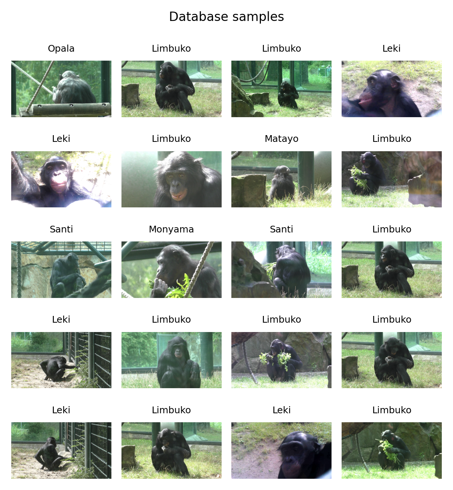

# Introduction
The Bonobos classification repository aims to reproduce the work of Bonobos individual classification from an auto-generated dataset using pre-trained models and a light annotation procedure.
The aim is to have a reproducible pipeline in order to build a primate identification tool in zoos or sanctuaries for various applications.

# Dataset
## Presentation
The provided dataset was recorded at the Zoo Berlin using a digital camcorder Panasonic HC-V757 and a cheap Logitech webcam, both of resolution 1280x720 at 30 fps. The videos can be assimilated to focal observation consisting of observing one particular individual and observing his/her actions and interactions. This may lead to having several individuals in the field of the camera, or none because of obstruction, camera manipulation, or the case of not having the individual in the webcam's field of view. No spatial information was annotated, nor was the presence of the individual in the field of the camera if several individuals were in the field of view. In this particular enclosure there are seven individuals  of different gender and age (gender/year of birth): Matayo (male/2019), Monyama (female/2010), Opala (female/1998), Santi (male/1981), Limbuko (male/1995), Leki (female/2014) and Samani female/2020). Samani was not incorporated into the dataset because of her constant proximity to her mother Monyama. A total of 100 videos inequitably distributed across six bonobo individuals is considered. The hand annotation consists of telling on which bonobo the recording is focusing on. The automatic annotation is based on OpenMMLab macaque detector.



## Download
The dataset is available on a dedicated [Zenodo repository](https://zenodo.org/records/11149418).
You may download it using your terminal and check its consistency.
A step-by-step instruction.

1. Make sure to have cloned this repo:
```
git clone https://github.com/ccp-eva/BonobosClassification.git
cd BonobosClassification
```

2. Download the 11149418.zip file from our Zenodo:
```
wget --content-disposition https://zenodo.org/api/records/11149418/files-archive
```
Alternatively, you can use your browser using this [link](https://zenodo.org/api/records/11149418/files-archive).

3. Check your download consistency with md5sum:
```
md5sum -c 11149418.md5
```

4. unzip the archive:
```
unzip 11149418.zip
```

You should obtain data.zip file, a data.md5sum file and the data agreement under which the data is shared.

5. unzip the data archive:
```
unzip data.zip
```

You should obtain a data folder with subfolders videos and detections, and subsubfolders with the bonobos' name.

6. Check the consistency with md5sum:
```
md5sum -c data.md5sum
```

If all files are ok. You are ready to proceed. If not, the download or unzipping phase should be re-conducted.

## Datasets generation

Different databases may be generated according to the source files. The script `create_database.py` is meant to create different databases according to the ROI consideration and score threshold. `python3 create_database.py` will create a ROI_S0 database which takes into account the ROI and all frames with bonobos detected regardless of the detection score. `python3 create_database.py -h`  for more options.
```
python3 create_database.py --video_input 'data/videos/ --detection_input data/detections --output_folder ROI_S0 --score-thr 0
```

Finally, the dataset may be split into the train, validation and test sets using `split_database.py`. The script will create another folder with the name of the database provided + "_split" with the different sets. You may check the distribution used in our work in [data_distribution.txt](data_distribution.txt).
```
python3 split_database.py ROI_S0
```

# Bonobo Individual Classification
## ML classification

To run different ML algorithms (not deep learned), you may first extract the features of each dataset by running `extract_feature.py` on the non split dataset (e.g. `ROI_S0`) and the train split (e.g. `ROI_S0_split/train`).
Then the `ml_classification.py` script will automatically run the classification on the non-split and split dataset.
```
python3 extract_feature.py ROI_S0
python3 extract_feature.py ROI_S0_split/train
python3 ml_classification.py ROI_S0
```

## ResNet classification.

ResNet classification may be run by calling the script `cnn_classification.py` on the generated split datasets. More options by calling `python3 cnn_classification.py -h`. The model will use the pre-trained weights of resnet18 provided by Pytorch. Make sure to download the weights before continuing: 
```
wget -P checkpoints https://download.pytorch.org/models/resnet18-5c106cde.pth
python3 cnn_classification.py ROI_S0_split
```

# To cite this work

## Paper:

Martin, PE. (2024). Dataset Generation and Bonobo Classification from Weakly Labelled Videos. In: Arai, K. (eds) Intelligent Systems and Applications. IntelliSys 2023. Lecture Notes in Networks and Systems, vol 823. Springer, Cham. https://doi.org/10.1007/978-3-031-47724-9_45

```
@InProceedings{10.1007/978-3-031-47724-9_45,
  author="Martin, Pierre-Etienne",
  editor="Arai, Kohei",
  title="Dataset Generation and Bonobo Classification from Weakly Labelled Videos",
  booktitle="Intelligent Systems and Applications",
  year="2024",
  publisher="Springer Nature Switzerland",
  address="Cham",
  pages="689--700",
  abstract="This paper presents a bonobo detection and classification pipeline built from the commonly used machine learning methods. Such application is motivated by the need to test bonobos in their enclosure using touch screen devices without human assistance. This work introduces a newly acquired dataset based on bonobo recordings generated semi-automatically. The recordings are weakly labelled and fed to a macaque detector in order to spatially detect the individual present in the video. Handcrafted features coupled with different classification algorithms and deep-learning methods using a ResNet architecture are investigated for bonobo identification. Performance is compared in terms of classification accuracy on the splits of the database using different data separation methods. We demonstrate the importance of data preparation and how a wrong data separation can lead to false good results. Finally, after a meaningful separation of the data, the best classification performance is obtained using a fine-tuned ResNet model and reaches 75{\%} of accuracy.",
  isbn="978-3-031-47724-9"
}
```

## Dataset:

Martin, P.-E., Kopp, K., & Haun, D. (2023). Bonobo Dataset (1.0.0) [Data set]. Zenodo. https://doi.org/10.5281/zenodo.11149418

```
@dataset{martin_2024_11149418,
  author       = {Martin, Pierre-Etienne and
                  Kopp, Kathrin and
                  Haun, Daniel},
  title        = {Bonobo Dataset},
  month        = may,
  year         = 2024,
  publisher    = {Zenodo},
  version      = {1.0.0},
  doi          = {10.5281/zenodo.11149418},
  url          = {https://doi.org/10.5281/zenodo.11149418}
}
```
## Software:

Pierre-Etienne Martin. (2024). ccp-eva/BonobosClassification: Software (v1.0.0). Zenodo. https://doi.org/10.5281/zenodo.xxxxxx

```
@software{pierre_etienne_martin_2024_xxxxx,
  author       = {Pierre-Etienne Martin},
  title        = {ccp-eva/BonobosClassification: Software},
  month        = may,
  year         = 2024,
  publisher    = {Zenodo},
  version      = {v1.0.0},
  doi          = {10.5281/zenodo.xxxxxx},
  url          = {https://doi.org/10.5281/zenodo.xxxxxx}
}
```

Get in touch with us directly if you have any questions: pierre_etienne_martin (at) eva.mpg.de.
